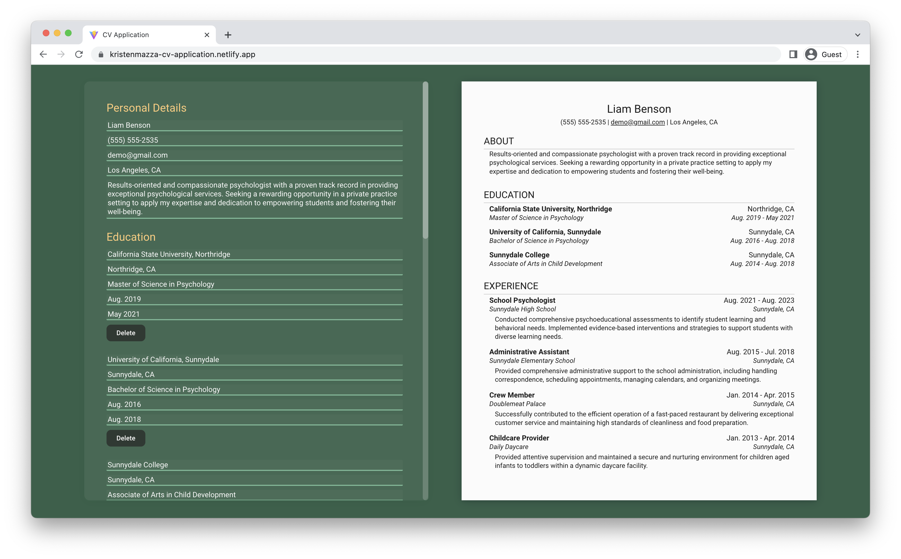

# CV Application
A curriculum vitae (CV) creator.

[Live Demo](https://kristenmazza-cv-application.netlify.app/) :point_left:

# Learning Objectives
This is my first project using React to build a user interface. Through this project, I gained a better understanding of React components, state and props, rendering techniques, and using UUID for generating unique keys.

# Setup Instructions
1. Install dependencies using `npm install`
2. Use `npm run dev` to start dev server and run the application in development mode